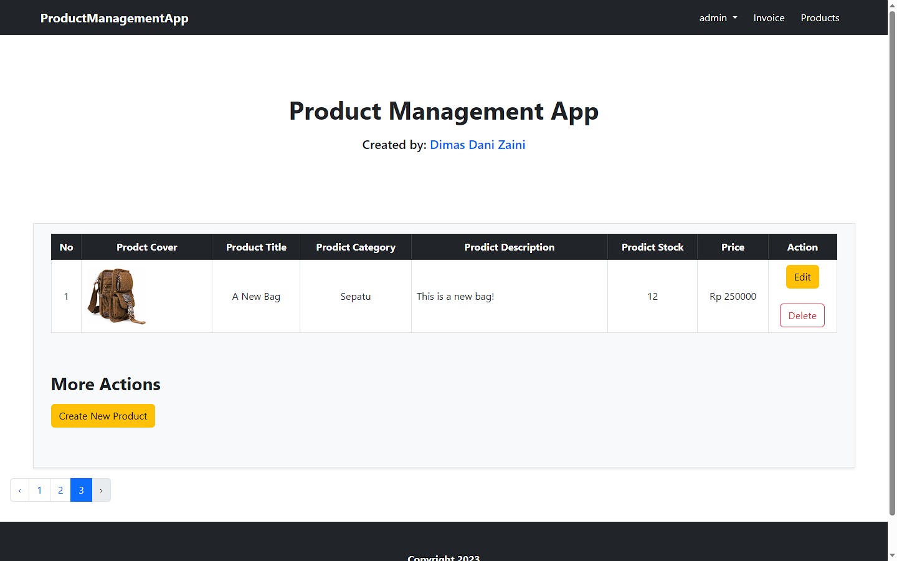
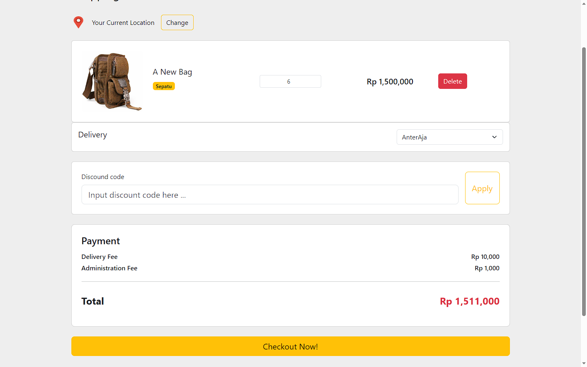
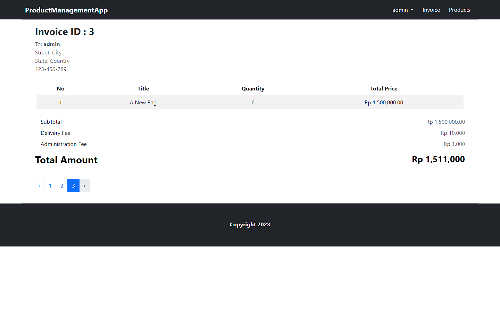

# ProductManagementApp
Product Management App is a simple website application with the aim of managing existing goods. This application was created for the purposes of the Back End Development final project using the Laravel programming language.

## Table of Contents
- [How to Install and Run the Program?](##how-to-install-and-run-the-program?)
- [How to Use the Project?](##how-to-use-the-project?)
- [What User Can Do?](##whatuser-can-do?)
- [What Admin Can Do?](##whatadmin-can-do?)

## How to Install and Run the Program?
Duplicate `.env.example` file and rename it to `.env`

In `.env` file, you need to make a database with the same name with  `DB_DATABASE=your_database_name`
Make sure your mySQL in XAMPP is turned on.

Then, run this command in your terminal:
```
npm install
php artisan key:generate
php artisan migrate:fresh --seed
```

Last, to run the program, type:
`php artisan serve`

It wil lunch it to your local host.

## How to Use the Project?
In the first time you open up the website, it will take you to the login page. 
As an user, you can login with this email and password:
```
email    : user@gmail.com
password : 12345678
```
As an admin, you can use:
```
email    : admin@gmail.com
password : 12345678
```

## What User Can Do?
User can:
+ See all of the products
+ Add to cart the products
+ Make an invoice

## What Admin Can Do?
Admin can:
+ See all of the products
+ CRUD the products
+ See all invoices

## Screenshots



